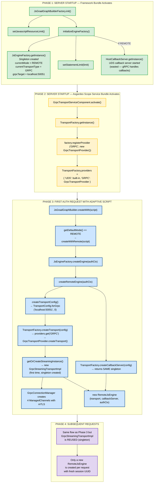

# Externalized GraalJS Architecture Diagrams

## Diagram 1: Full Component Map

```mermaid
graph TB
    %% ===== STYLES =====
    classDef active fill:#d4edda,stroke:#28a745,stroke-width:2px,color:#000
    classDef inactive fill:#fff3cd,stroke:#ffc107,stroke-width:2px,color:#000,stroke-dasharray: 5 5
    classDef iface fill:#cce5ff,stroke:#004085,stroke-width:2px,color:#000
    classDef dead fill:#f8d7da,stroke:#dc3545,stroke-width:1px,color:#000,stroke-dasharray: 3 3
    classDef proto fill:#e2d5f1,stroke:#6f42c1,stroke-width:2px,color:#000
    classDef sidecar fill:#d1ecf1,stroke:#0c5460,stroke-width:2px,color:#000

    %% ===== IDENTITY SERVER =====
    subgraph IS["IDENTITY SERVER (JVM)"]
        direction TB

        subgraph GraphLayer["GRAPH BUILDING LAYER"]
            direction TB
            JGGB["<b>JsGraalGraphBuilder</b><br/>Translates adaptive auth script into<br/>authentication graph nodes.<br/>Branches on REMOTE/LOCAL at every<br/>entry point: createWith, evaluate.<br/>Exposes 7 ThreadLocal accessors<br/>for gRPC callback threads."]
            JGGBF["<b>JsGraalGraphBuilderFactory</b><br/>Creates builder instances with<br/>Polyglot Context. init bootstraps<br/>the entire engine abstraction.<br/>Owns persist/restoreCurrentContext<br/>for LOCAL mode binding lifecycle."]
            GSJF["<b>GraalSerializableJsFunction</b><br/>Stores JS function source as string<br/>for Java serialization between steps.<br/>toString fallback for remotely<br/>reconstructed functions."]
            JGGB --> JGGBF
            JGGB --> GSJF
        end

        subgraph EngineLayer["ENGINE ABSTRACTION LAYER"]
            direction TB
            JEF["<b>JsEngineFactory</b><br/><i>Singleton + Abstract Factory</i><br/>Routes LOCAL → LocalJsEngine<br/>or REMOTE → RemoteJsEngine.<br/>Mode hardcoded to REMOTE.<br/>Transport hardcoded to GRPC."]

            subgraph Engines["Engine Implementations"]
                direction LR
                LJE["<b>LocalJsEngine</b><br/>Wraps GraalVM Polyglot Context.<br/>evaluate calls context.eval<br/>in same JVM. No network.<br/>Uses GraalSerializer for<br/>binding extraction."]
                RJE["<b>RemoteJsEngine</b><br/><i>Per-request, implements<br/>HostFunctionHandler</i><br/>Holds sessionId, hostFunctions,<br/>bindings, proxyObjectCache,<br/>hostFunctionRefs, accumulated<br/>DynamicBaseNode.<br/>Serializes to protobuf,<br/>calls transport.sendEvaluate.<br/>Receives callbacks, sets up<br/>ThreadLocals, invokes host<br/>functions via reflection."]
            end

            JSE["<b>JsEngine</b> <i>(interface)</i><br/>evaluate, executeCallback,<br/>getBindings, putBinding,<br/>registerHostFunctions,<br/>getSessionId, close"]
            ER["<b>EvaluationResult</b><br/><i>Immutable value object</i><br/>success, result, updatedBindings,<br/>errorMessage, errorType, elapsedMs"]

            JEF --> LJE
            JEF --> RJE
            LJE -.->|implements| JSE
            RJE -.->|implements| JSE
            LJE --> ER
            RJE --> ER
        end

        subgraph TransportAbstraction["TRANSPORT ABSTRACTION LAYER"]
            direction TB
            TF["<b>TransportFactory</b><br/><i>Singleton + Strategy SPI</i><br/>Registry: Map of String →<br/>TransportProvider.<br/>UDS registered built-in.<br/>GRPC registered by OSGi at runtime."]
            RET["<b>RemoteEngineTransport</b> <i>(iface)</i><br/>sendEvaluate, sendExecuteCallback,<br/>connect, isConnected, close"]
            CS["<b>CallbackServer</b> <i>(interface)</i><br/>registerHandler, unregisterHandler,<br/>getCallbackAddress, start, close<br/><br/><b>HostFunctionHandler</b> <i>(inner iface)</i><br/>invokeHostFunction, getContextProperty,<br/>setContextProperty, storeObjectReference,<br/>resolveObjectReference"]
            TC["<b>TransportConfig</b><br/><i>Immutable value object + Builder</i><br/>Static factories: forGrpc, forUds,<br/>forHttp, forWebSocket"]
            REC["<b>RemoteEngineConstants</b><br/>Wire protocol constants:<br/>__proxyref__::, __hostref__::,<br/>__keys__, __isContextProxy,<br/>:: path separator, mTLS config"]

            TF --> RET
            TF --> CS
            TF --> TC
        end

        subgraph GrpcImpl["ACTIVE: gRPC TRANSPORT<br/><i>(asgardeo.scope.service bundle)</i>"]
            direction TB
            GTSC["<b>GrpcTransportServiceComponent</b><br/><i>OSGi @Activate</i><br/>Registers GrpcTransportProvider<br/>with TransportFactory as GRPC.<br/>Bridges gRPC into framework<br/>without compile-time dependency."]
            GTP["<b>GrpcTransportProvider</b><br/><i>Factory + Singleton Holder</i><br/>Double-checked locking.<br/>Both createTransport and<br/>createCallbackServer return<br/>the SAME singleton instance."]
            GSTI["<b>GrpcStreamingTransportImpl</b><br/><i>Dual-Interface Singleton</i><br/>Implements RemoteEngineTransport<br/>+ CallbackServer in one object.<br/>Opens bidi stream per request.<br/>Outbound: sendEvaluate blocks<br/>on CompletableFuture.<br/>Inbound: stream observer routes<br/>callbacks to callbackExecutor pool.<br/>Shared: sessionHandlers map,<br/>streamRegistry, per-stream locks."]
            GCM["<b>GrpcConnectionManager</b><br/><i>Singleton</i><br/>4-channel ManagedChannel pool.<br/>Round-robin selection.<br/>mTLS: client.pem, client-key.pem,<br/>ca.pem from carbon.home."]

            GTSC --> GTP
            GTP --> GSTI
            GSTI --> GCM
        end

        subgraph UdsImpl["INACTIVE: UDS TRANSPORT<br/><i>(built into framework bundle)</i>"]
            direction TB
            UTI["<b>UdsTransportImpl</b><br/><i>Adapter</i><br/>Wraps legacy UdsClient.<br/>Length-prefixed protobuf<br/>over Unix Domain Socket."]
            UCSI["<b>UdsCallbackServerImpl</b><br/><i>Adapter</i><br/>Wraps HostCallbackServer.<br/>Bridges interface mismatch."]
            HCS["<b>HostCallbackServer</b><br/><i>Legacy Singleton</i><br/>AFUNIXServerSocket on<br/>/tmp/graaljs-callback-XXXX.sock<br/>Started at init even in gRPC mode."]
            UC["<b>UdsClient</b><br/>Low-level socket client.<br/>1-byte type + 4-byte length<br/>+ payload wire protocol."]

            UTI --> UC
            UCSI --> HCS
        end

        subgraph SerLayer["SERIALIZATION LAYER"]
            direction TB
            PS["<b>ProtobufSerializer</b><br/>Java ↔ protobuf SerializedValue.<br/>Primitives, maps, arrays, functions.<br/>Lazy proxy pattern: complex POJOs<br/>cached with UUID, sidecar fetches<br/>properties on demand via<br/>__proxyref__::uuid::property.<br/>ThreadLocal session proxy cache."]
            PPN["<b>PropertyPathNavigator</b><br/>Navigates nested paths like<br/>steps::1::subject::claims::email<br/>on ProxyObject, ProxyArray, Map, POJO.<br/>Handles __proxyref__, __hostref__,<br/>__keys__ specials.<br/>OSGi classloader reflection fallback."]
            PTR["<b>ProxyTypeResolver</b><br/>1. shouldUseProxyPattern: class name<br/>has .User/.model/.domain or getters>3.<br/>Prevents eager serialization of<br/>domain objects that trigger DB calls.<br/>2. isJsWrapperProxy: detects<br/>JsGraal*/JsServlet*/JsStep* types."]
            GS["<b>GraalSerializer</b><br/>Polyglot Value ↔ Java serializable.<br/>Used by LOCAL mode and by<br/>persist/restoreCurrentContext."]
        end

        %% Cross-layer connections
        JGGB -->|"JsEngineFactory<br/>.createEngine(authCtx)"| JEF
        RJE -->|"transport<br/>.sendEvaluate()"| GSTI
        RJE -->|"callbackServer<br/>.registerHandler()"| GSTI
        JEF -->|"TransportFactory<br/>.createTransport(config)"| TF
        TF -->|"provider<br/>.createTransport()"| GTP
        GSTI -.->|implements| RET
        GSTI -.->|implements| CS
        UTI -.->|implements| RET
        UCSI -.->|implements| CS
        RJE --> PS
        RJE --> PPN
        GSTI --> PS
        GSTI --> PTR
        LJE --> GS
        JGGBF --> GS
        RJE --> REC
    end

    %% ===== NETWORK =====
    GSTI <-->|"gRPC bidirectional stream<br/>mTLS, port 50051<br/>one stream per request"| GSST

    %% ===== SIDECAR =====
    subgraph SC["GRAALJS SIDECAR (separate JVM)"]
        direction TB
        GSST["<b>GrpcStreamingServerTransport</b><br/>gRPC server hosting bidi RPC.<br/>Stream observer demuxes messages<br/>by payload type: requests to<br/>executor threads, responses to<br/>pending futures. mTLS support."]
        JESI["<b>JsEngineServiceImpl</b><br/>Core JS execution. Fresh GraalVM<br/>Context per request with statement<br/>limits. handleEvaluate: parse →<br/>create context → register stubs →<br/>create proxy → deserialize bindings<br/>→ context.eval(script) → extract<br/>bindings → build response."]
        HFS["<b>HostFunctionStub</b><br/><i>implements ProxyExecutable</i><br/>Registered in JS as executeStep,<br/>sendError, fail, showPrompt, etc.<br/>On call: convert JS args → Java,<br/>send HostFunctionRequest on stream<br/>to IS, block on future until<br/>IS responds."]
        DCP["<b>DynamicContextProxy</b><br/><i>implements ProxyObject</i><br/>Represents context object and<br/>nested properties. getMember:<br/>check cache, miss → send<br/>ContextPropertyRequest to IS.<br/>If response is proxy, create<br/>nested DynamicContextProxy.<br/>putMember: write-back to IS.<br/>getMemberKeys: __keys__ query."]
        SCC["<b>StreamingCallbackClient</b><br/>Sends callback requests on bidi<br/>stream, blocks on CompletableFuture.<br/>gRPC event thread delivers responses.<br/>5-second timeout prevents deadlock."]
        HCC["<b>HostCallbackClient</b><br/>Convenience wrapper. Builds protobuf<br/>requests, serializes args, tracks<br/>round-trip callback timing."]
        SCO["<b>SidecarConstants</b><br/>Mirror of RemoteEngineConstants.<br/>Both sides must agree on<br/>__proxyref__::, __hostref__::,<br/>__keys__, :: separator etc."]
        MN["<b>Main</b><br/>Entry point. CLI args select<br/>transport (uds/grpc), port,<br/>statement limit, thread pool size."]

        GSST --> JESI
        JESI --> HFS
        JESI --> DCP
        HFS --> SCC
        DCP --> SCC
        SCC --> HCC
        MN --> GSST
        MN --> JESI
    end

    %% ===== PROTO =====
    subgraph Proto["SHARED PROTOCOL DEFINITION"]
        PROTO["<b>js_engine.proto + js_engine_grpc.proto</b><br/>Messages: EvaluateRequest/Response,<br/>ExecuteCallbackRequest/Response,<br/>HostFunctionRequest/Response,<br/>ContextProperty Request/Response/Set,<br/>StreamMessage bidi wrapper.<br/>Types: SerializedValue oneof<br/>(string, int, double, bool, null, map,<br/>array, function, proxy object).<br/>Services: JsEngineStreamingService<br/>(ACTIVE bidi), JsEngineService (STALE<br/>unary), HostCallbackService (STALE unary)."]
    end

    GSTI -.->|"compiled from"| PROTO
    GSST -.->|"compiled from"| PROTO
    PS -.->|"serializes to/from"| PROTO

    %% ===== APPLY STYLES =====
    class JGGB,JGGBF,GSJF,JEF,RJE,JSE,ER,TF,RET,CS,TC,REC,PS,PPN,PTR active
    class GTSC,GTP,GSTI,GCM active
    class GSST,JESI,HFS,DCP,SCC,HCC,SCO,MN sidecar
    class UTI,UCSI,HCS,UC inactive
    class GS active
    class PROTO proto
    class LJE active
```

## Diagram 2: Pattern & Lifetime Map

```mermaid
graph LR
    classDef singleton fill:#d4edda,stroke:#28a745,stroke-width:2px,color:#000
    classDef perReq fill:#cce5ff,stroke:#004085,stroke-width:2px,color:#000
    classDef perTarget fill:#fff3cd,stroke:#ffc107,stroke-width:2px,color:#000
    classDef iface fill:#f0f0f0,stroke:#666,stroke-width:1px,color:#000
    classDef dead fill:#f8d7da,stroke:#dc3545,stroke-width:1px,color:#000,stroke-dasharray: 3 3
    classDef bundle fill:#e2d5f1,stroke:#6f42c1,stroke-width:2px,color:#000

    subgraph Patterns["DESIGN PATTERNS"]
        direction TB

        subgraph SF["Singleton + Abstract Factory"]
            JEF2["<b>JsEngineFactory</b><br/><i>Lifetime: JVM</i><br/>One instance creates all engines"]
        end

        subgraph SSPI["Singleton + Strategy SPI"]
            TF2["<b>TransportFactory</b><br/><i>Lifetime: JVM</i><br/>Plugin registry for transports"]
        end

        subgraph DIS["Dual-Interface Singleton"]
            GSTI2["<b>GrpcStreamingTransportImpl</b><br/><i>Lifetime: per-grpcTarget</i><br/>One object = transport + callbacks"]
        end

        subgraph FSH["Factory + Singleton Holder"]
            GTP2["<b>GrpcTransportProvider</b><br/><i>Lifetime: bundle</i><br/>Double-checked locking on instance"]
        end

        subgraph OP["Object Pool"]
            GCM2["<b>GrpcConnectionManager</b><br/><i>Lifetime: per-grpcTarget</i><br/>4 channels, round-robin, mTLS"]
        end

        subgraph OSGI["OSGi Service Component"]
            GTSC2["<b>GrpcTransportServiceComponent</b><br/><i>Lifetime: bundle</i><br/>Registers provider at activation"]
        end

        subgraph ADP["Adapter"]
            UTI2["<b>UdsTransportImpl</b><br/>wraps UdsClient"]
            UCSI2["<b>UdsCallbackServerImpl</b><br/>wraps HostCallbackServer"]
        end

        subgraph MB["Mode Branching"]
            JGGB2["<b>JsGraalGraphBuilder</b><br/><i>Lifetime: per-auth-flow</i><br/>if REMOTE / else LOCAL<br/>at every entry point"]
        end

        subgraph SS["Session-Scoped + Handler"]
            RJE2["<b>RemoteJsEngine</b><br/><i>Lifetime: per-request</i><br/>UUID session, host fns, bindings,<br/>proxy cache, graph node accumulator"]
            LJE2["<b>LocalJsEngine</b><br/><i>Lifetime: per-request</i><br/>Wraps Polyglot Context"]
        end

        subgraph IVO["Immutable Value Object + Builder"]
            TC2["<b>TransportConfig</b><br/>forGrpc / forUds / forHttp / forWebSocket"]
            ER2["<b>EvaluationResult</b><br/>success / failure factory methods"]
        end

        subgraph LP["Lazy Proxy"]
            PS2["<b>ProtobufSerializer</b><br/>__proxyref__::uuid cache"]
            PTR2["<b>ProxyTypeResolver</b><br/>shouldUseProxyPattern heuristic"]
        end
    end

    subgraph DeadCode["DEAD / WASTED CODE"]
        direction TB
        D1["TransportType enum<br/><i>never drives any decision</i>"]
        D2["setCurrentMode / setCurrentTransportType<br/><i>setters exist, never called</i>"]
        D3["sidecarSocketPath / setSidecarSocketPath<br/><i>UDS path unused, transport hardcoded GRPC</i>"]
        D4["createUdsTransport / createGrpcTransport<br/><i>deprecated factory methods</i>"]
        D5["TransportConfig.forHttp / forWebSocket<br/><i>no providers exist</i>"]
        D6["HostCallbackServer started at init<br/><i>gRPC streaming handles all callbacks</i>"]
        D7["getContextForJsThreadLocal<br/>getCurrentBuilderThreadLocal<br/><i>getter accessors never called</i>"]
        D8["JsEngineService + HostCallbackService<br/><i>stale unary gRPC services in proto</i>"]
    end

    class JEF2,TF2 singleton
    class GSTI2,GCM2 perTarget
    class GTP2,GTSC2 bundle
    class JGGB2,RJE2,LJE2 perReq
    class TC2,ER2,PS2,PTR2 iface
    class UTI2,UCSI2 iface
    class D1,D2,D3,D4,D5,D6,D7,D8 dead
```

## Diagram 3: Startup & Wiring Sequence

## Legend

| Color | Meaning |
|-------|---------|
| Green | Active, in-use components |
| Blue | Per-request / runtime components |
| Yellow/dashed border | Inactive UDS path (built-in but not used) |
| Red/dashed border | Dead code (never called / wasted) |
| Purple | Protocol definitions / shared |
| Cyan | Sidecar components |
